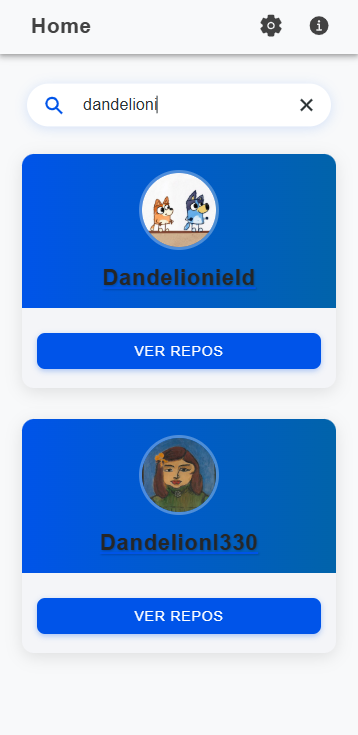
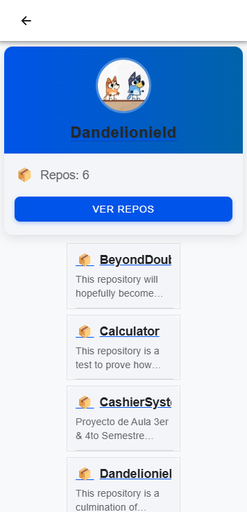

# Graphic GitHub Api Search 🚀

[](https://ionicframework.com/)
[](https://angular.io/)
[](https://opensource.org/licenses/MIT)

A cross-platform mobile application built with Ionic for searching GitHub profiles. built with **Ionic Framework** and **Angular**. Officially supports Android, iOS, and PWA. Features include:

- 🕵️ User search functionality
- 👤 Profile visualization
- 📂 Repository listing
- ⚙️ Settings persistence using Ionic Storage

### Home Page



### Profile Detail page



### Settings page


## 🛠 Installation & Setup

**Prerequisites**:  
- Node.js v16+
- npm v8+
- Angular CLI v15+
- Ionic CLI v7+

```bash
# 1. Clone repository
git clone https://github.com/Dandelionield/GraphicGitHubApiSearch.git

# 2. Install dependencies
npm install -g @ionic/cli

# 3. Browse onto the Repository
cd GraphicGitHubApiSearch

# 4. Start development server
ionic serve